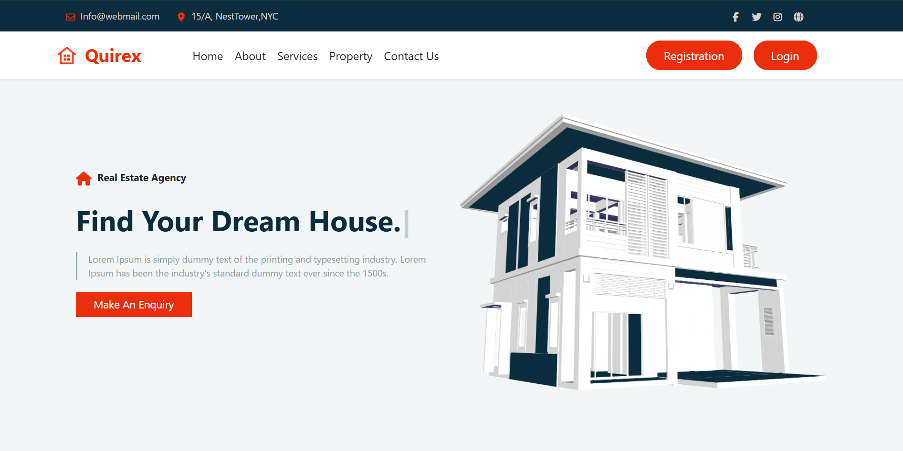
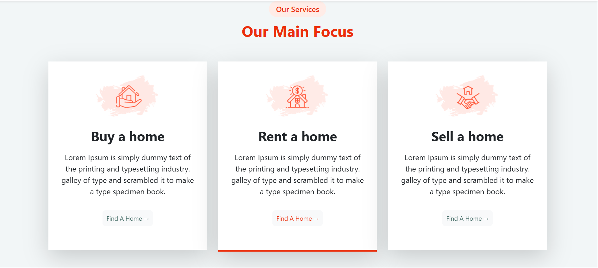
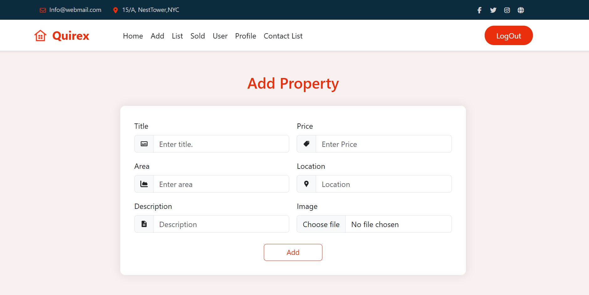
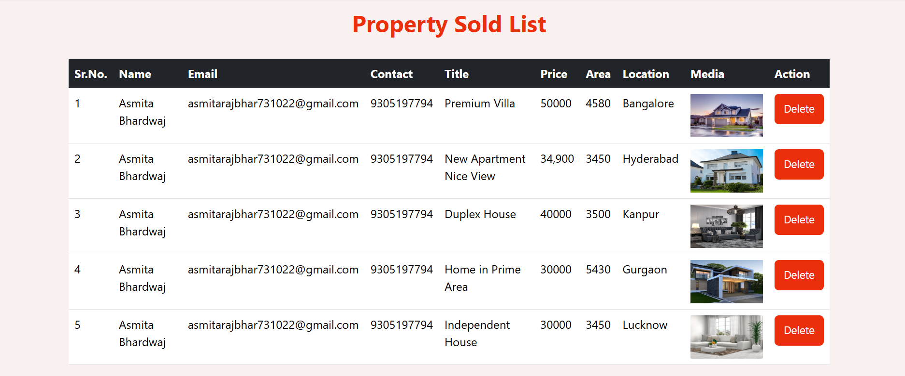

# Quirex - Real Estate Platform

## Overview

Quirex is a full-stack real estate platform built using the MERN Stack (MongoDB, Express.js, React.js, Node.js).
It allows users to explore properties, add new listings, and manage real estate data in a smooth and user-friendly interface.

The project aims to simplify property management for both buyers and sellers through a modern, responsive, and easy-to-use web application.

## Live Demo
[Quirex Live Demo](https://quirex-frontend.onrender.com/)

## Features

 🏠 Property Listings – Add and view property details with images.

 🔒 User Authentication – Secure login/signup for property management.

 📷 Image Uploads – Upload property images via backend API.

 ⚡ MERN Stack – Full-stack implementation with separate frontend and backend deployments.

 🌐 Responsive UI – Works seamlessly on desktops and mobiles.

 🚀 Deployed on Render – Backend and frontend hosted on Render

## 🛠️ Tech Stack

- **MongoDB** – Database for storing properties  
- **Express.js** – Backend framework for building REST APIs  
- **React.js** – Frontend UI development  
- **Node.js** – Backend runtime environment  
- **Axios** – For making API calls  
- **SweetAlert2** – For alerts & notifications  
- **Bootstrap** – For responsive UI components  
- **Render** – For deployment of frontend & backend  

## Screenshots

## 📸 Screenshots

### Home Page

### Property Page

### Property Listings

### Sold List

## Future Enhancements

Implement user authentication (JWT/Passport)

Add search & filter for properties

Enable property editing and deletion

Integrate payment gateway for property bookings

## Contributing

Pull requests are welcome! For significant changes, please open an issue first to discuss what you would like to change.
