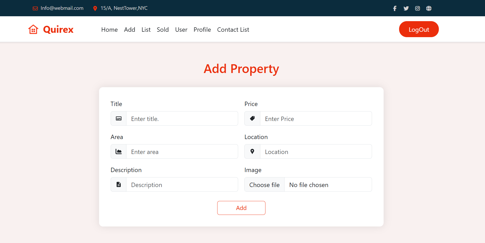
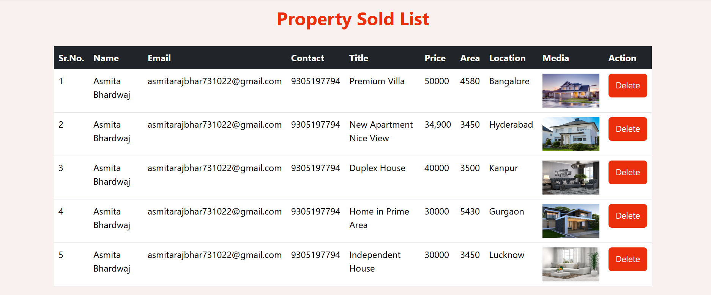

# 🏠 Quirex - Smart Real Estate Platform

A modern real estate platform where users can search, explore, and manage properties with ease.

## Overview

Quirex is a full-stack real estate platform designed to help users discover, explore, and manage properties through a modern and user-friendly interface.

The platform allows users to search properties by location, view detailed property information, purchase available properties, and interact with a built-in chatbot assistant. With dedicated Admin and User functionalities, Quirex provides a complete property management experience.

## Live Demo

[Quirex Live Demo](https://quirex-frontend.onrender.com/)

## Features

🏠 Property Listings – Add and view property details with images.

🔍 Smart Property Search – Search properties by location with an improved user experience.

👤 User Authentication – Secure login and registration system with role-based access.

📷 Image Uploads – Upload and manage property images.

🤖 Quirex Assistant Chatbot – Interactive chatbot with English and Hindi language support.

📋 Property Purchase Management – Users can explore and purchase available properties.

📞 Contact Management – Users can submit inquiries through the Contact Us page.

🌐 Responsive UI – Works seamlessly across desktops, tablets, and mobile devices.

🚀 Deployed on Render – Frontend and backend hosted on Render.

## 🛠️ Tech Stack

- **MongoDB Atlas** – Database for storing application data
- **Express.js** – Backend framework for building REST APIs
- **React.js** – Frontend user interface development
- **Node.js** – Backend runtime environment
- **Axios** – API communication
- **React Hook Form** – Form handling
- **Yup** – Form validation
- **SweetAlert2** – Alerts and notifications
- **Bootstrap** – Responsive UI components
- **React Icons** – Icons and UI enhancements
- **Render** – Frontend and backend deployment

### Add Property

### Sold Property List

## Future Enhancements

- Advanced property filters and sorting
- Property wishlist feature
- Google Maps integration
- AI-powered property recommendations
- Email notification system
- Online property booking functionality
- Property comparison feature
- Enhanced chatbot capabilities

## Contributing

Pull requests are welcome! For significant changes, please open an issue first to discuss what you would like to change.

## Developer

**Asmita Rajbhar**

B.Tech (Information Technology)

Institute of Engineering and Technology, Ayodhya
